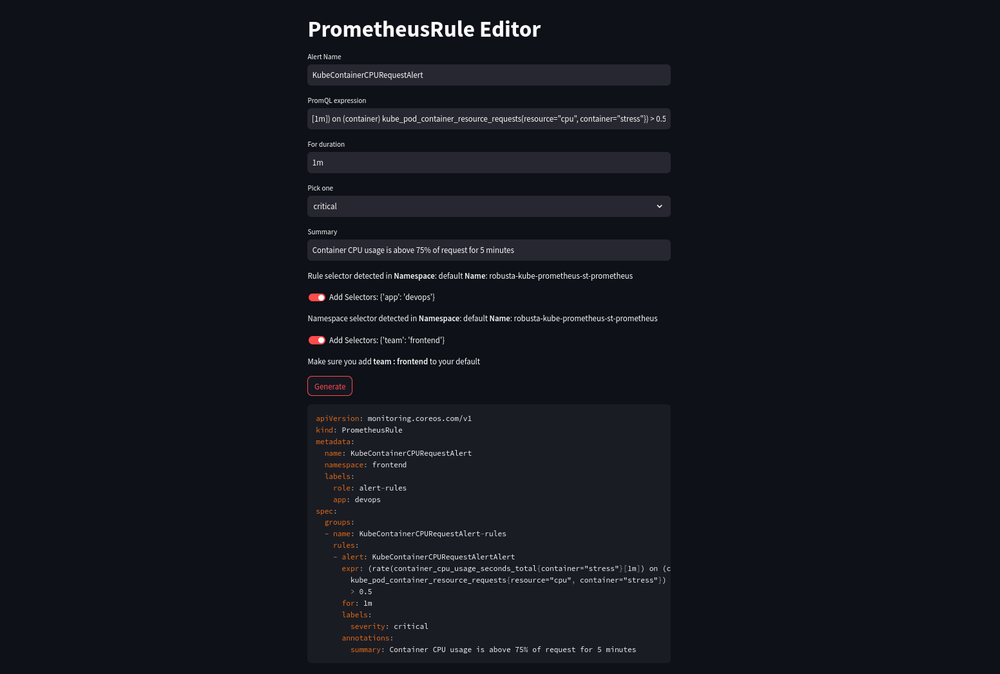

# PrometheusRule Editor

A Python based web application to help with creating PrometheusRule custom resources.

## Features
- [x] Auto-generate PrometheusRule YAML
- [x] Auto-detect Prometheus `ruleSelector` and `ruleNamespaceSelector`
- [x] Add selector labels to YAML by default
- [ ] Auto-detect multiple Prometheus-Operators
- [ ] Switch between multiple operators
- [ ] Check namespaces for `ruleNamespaceSelectors`

## Try it out

1. Clone the repository 
```bash
git clone https://github.com/pavangudiwada/prom-rule-editor.git && cd prom-rule-editor
```

2. Install dependencies

```bash
pip install -r requirements.txt    
```

3. Run the web app
```bash
streamlit run manual_alert.py
```

4. Go to [http://localhost:8501](http://localhost:8501)

## Sample


